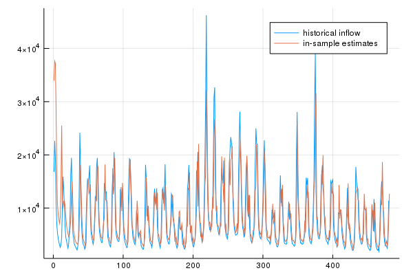

# Examples

## Water inflow

Let's model some monthly water inflow data from the Northeast of Brazil using a Lognormal GAS model. Since inflow is a highly seasonal phenomenon, we will utilize lags 1 and 12. The former aims to characterize the short-term evolution of the series, while the latter characterizes the seasonality. The full code is in the examples folder.

```julia
# Convert data to vector
y = Vector{Float64}(vec(inflow'))

# Specify GAS model: here we use lag 1 for trend characterization and 
# lag 12 for seasonality characterization
gas = GAS([1, 12], [1, 12], LogNormal, 0.0)

# Estimate the model via MLE
fit!(gas, y)

# Obtain in-sample estimates for the inflow
y_gas = fitted_mean(gas, y, dynamic_initial_params(y, gas))

# Compare observations and in-sample estimates
plot(y)
plot!(y_gas)
```

The result can be seen in the following plot.

